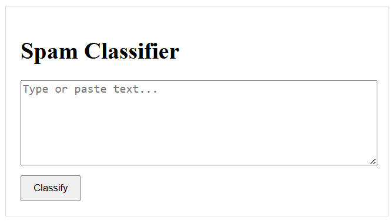
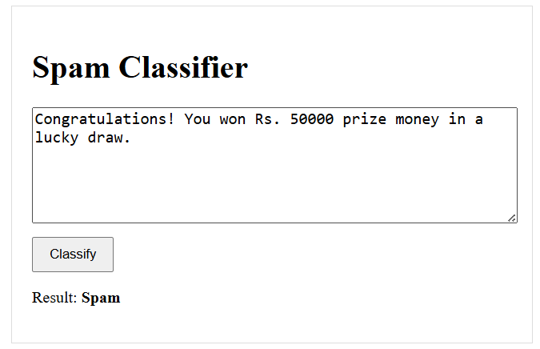
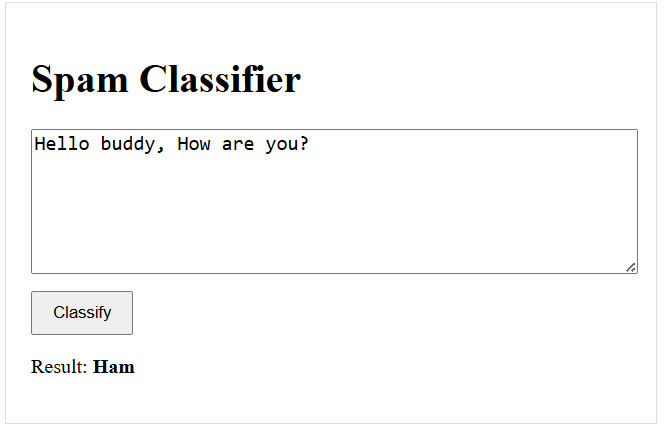

# 📧 Spam-Classifier API + Angular UI

Live demo → **[https://spam-classifier-api-vrk2.onrender.com](https://spam-classifier-api-vrk2.onrender.com)**  

  
*Landing page – paste text and hit “Classify”*

  
*Example result (“Spam” detected)*

  
*Example result (Ham)*

---

## 🛠 Tech Stack
- **FastAPI** – REST endpoint `/predict`
- **scikit-learn** – TF-IDF + model saved as `model.joblib`
- **Angular 17 (stand-alone)** – single-page UI
- **Render** – one service hosts API & static files

## 🚀 Quick Start
git clone https://github.com/lppranjal/spam-classifier-api.git
cd spam-classifier-api

1. Backend
python -m venv .venv && source .venv/bin/activate
pip install -r requirements.txt
uvicorn app.api:app --reload

2. Frontend (optional dev mode)
cd spam-ui
npm install
ng serve # http://localhost:4200

## 🖥 Production Build & Deploy

1. `cd spam-ui && ng build --configuration=production`  
2. Copy `dist/spam-ui/browser/*` → `app/static/`  
3. Commit and push – Render auto-deploys both API & UI.

## 🤖 API Reference

POST /predict
{
"text": "Congratulations! You won a free ticket."
}
→ { "result": "spam", "probability": 0.97 }

## 📸 Screenshots

| UI | Description |
|----|-------------|
|  | Paste a message and click **Classify** |
|   | Displays “Spam” or “Ham” |

